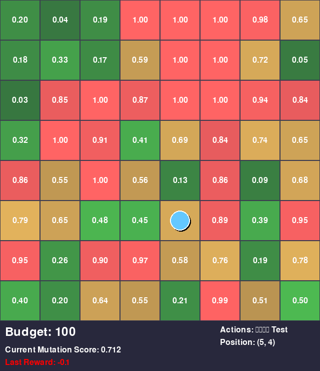

# Model Outputs and Demo

This directory contains the outputs of the trained models and a demonstration of the random agent in the Enhanced Genetic Mutation Environment.

## Project Summary

The goal of the project is to simulate genetic mutation environments where agents can learn to find high-value mutations. The simulation provides an environment for testing different reinforcement learning algorithms and visualizes agent interactions. Agents must efficiently navigate an 8x8 grid to discover and test genetic mutations while managing a limited budget of 100 units.

## Demo GIF

Below is a demonstration of a random agent interacting with the environment:



## Visualization Elements

The demo showcases the Enhanced Genetic Mutation Environment with the following visual components:

### 🧬 **Grid Environment**
- **8x8 Grid**: Each cell represents a potential genetic mutation site
- **Mutation Values**: Displayed as numbers (0.00-1.00) in each cell
- **Color Coding**:
  - 🟢 **Green**: Low-value mutations (< 0.5)
  - 🟡 **Yellow**: Medium-value mutations (0.5-0.8)
  - 🔴 **Red**: High-value mutations (> 0.8)
- **Transparency**: Cell opacity reflects mutation strength

### 🤖 **Agent Visualization**
- **Blue Circle**: The RL agent with pulsing animation
- **White Outline**: Agent boundary for visibility
- **Shadow Effect**: Adds depth to the agent representation
- **Position Tracking**: Agent moves one cell at a time

### 🎯 **Testing Animation**
- **Green Ring**: Appears when testing yields positive reward
- **Red Ring**: Appears when testing yields negative reward
- **Expanding Effect**: Ring grows outward during test action

### 📊 **Information Panel**
- **Budget Counter**: Shows remaining test budget (starts at 100)
- **Current Mutation Score**: Value at agent's current position
- **Last Reward**: Color-coded reward from previous action
- **Position Coordinates**: Agent's (row, col) location
- **Action Legend**: Available actions (↑↓←→ Test)

## Agent Actions

The agent can perform 5 different actions:

| Action | Description | Cost | Reward |
|--------|-------------|------|--------|
| **Test** | Evaluate mutation at current position | 1 budget unit | +10 (high), +5 (medium), -2 (low) |
| **Up** | Move one cell upward | Free | -0.1 (movement penalty) |
| **Down** | Move one cell downward | Free | -0.1 (movement penalty) |
| **Left** | Move one cell leftward | Free | -0.1 (movement penalty) |
| **Right** | Move one cell rightward | Free | -0.1 (movement penalty) |

## Trained Models

This directory contains trained reinforcement learning models:

### 📁 **dqn/**
- **Deep Q-Network (DQN)** implementation
- Model file: `genetic_dqn.zip`
- Learning algorithm: Q-learning with neural network approximation
- Exploration strategy: ε-greedy with decay

### 📁 **pg/**
- **Policy Gradient methods**
- **A2C**: Advantage Actor-Critic (`a2c.zip`)
- **PPO**: Proximal Policy Optimization (`ppo.zip`)
- Direct policy optimization approaches

## Episode Structure

Each episode in the environment follows this pattern:

1. **🚀 Start**: Agent begins at center position (4,4) with 100 budget
2. **🔍 Exploration**: Agent navigates grid to discover mutation landscape
3. **🧪 Testing**: Agent tests promising mutations (costs budget)
4. **⏹️ Termination**: Episode ends when budget reaches 0
5. **📈 Evaluation**: Total reward and episode length recorded

## Running the Demo

To generate your own demo GIF:

```bash
cd implementations/
python3 demo_random_agent.py
```

Choose option 1 for GIF creation or option 2 for interactive real-time viewing with controls:
- **SPACE**: Pause/Resume
- **ESC/Q**: Quit
- **F**: Speed up (static demo only)
- **S**: Slow down (static demo only)

